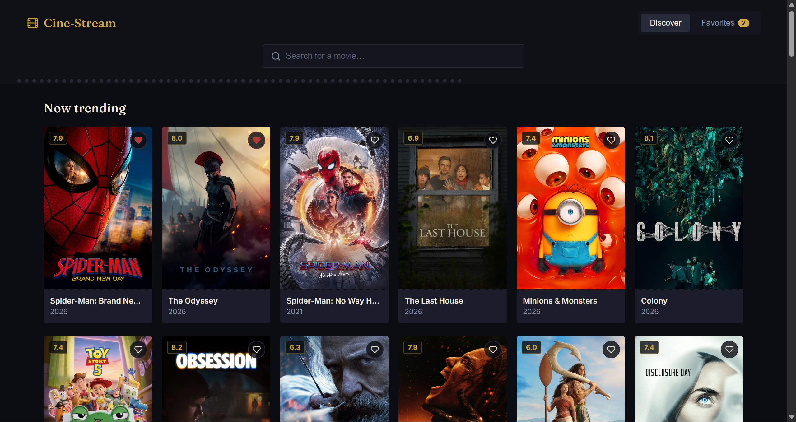
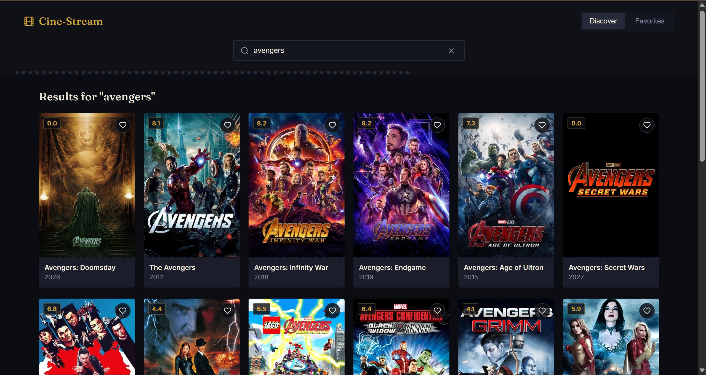
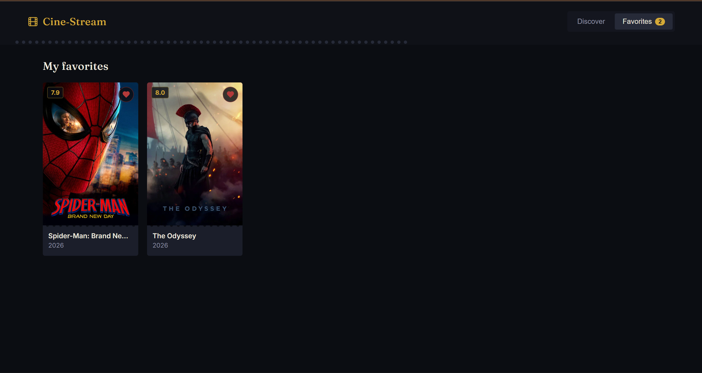

# Cine-Stream 🎬

A full-stack movie discovery application powered by the **TMDB API**, with a React frontend and a lightweight Node/Express backend. Cine-Stream lets users discover trending movies, search for titles, continuously load more results, and save movies to a personal favorites list.

> **Project status:** Core discovery features (browsing, search, infinite scroll, and favorites) are implemented, now backed by a Node/Express server. AI-powered recommendations are planned for a future release.

**Live Demo:** https://cinestream-zeq2.onrender.com/  
**GitHub Repository:** https://github.com/Akarsh-Coding/CineStream/tree/main

---

## ✨ Features

### Core Architecture & API Consumption

- ⚛️ React + Vite project setup
- 🎬 TMDB API integration via a backend proxy
- 🔐 API key held server-side, never exposed to the browser
- 🧭 Discover and Favorites views
- 🔎 Movie search
- 🖼️ Responsive movie-card grid
- ⭐ Movie ratings and release years
- ❤️ Favorites functionality
- ⚠️ Loading, error, and empty states
- 🎨 Dark, cinema-inspired user interface

### Performance & Persistence

- ♾️ Infinite scrolling for movie discovery
- 🔍 Debounced search input to reduce unnecessary API requests
- ❤️ Persistent favorites stored locally in the browser
- 🚦 Loading-more state while additional pages are fetched
- 🛡️ Request handling to prevent outdated API responses from overwriting newer results

---

## 🛠️ Tech Stack

| Technology | Purpose |
| --- | --- |
| **React 18** | Frontend UI and application state |
| **Vite** | Frontend development server and production build |
| **Node.js / Express** | Backend server that proxies TMDB requests and holds the API key |
| **TMDB API** | Movie data, posters, ratings, and search |
| **Lucide React** | UI icons |
| **JavaScript (ES Modules)** | Application logic |
| **CSS** | Styling and responsive layout |
| **LocalStorage** | Favorites persistence |
| **Render** | Deployment (Node web service) |

The `main` branch uses React 18.3.1, Vite 5.4.x, and Lucide React 0.383.x on the frontend, with an Express server under `server/`.

---

## 📸 Screenshots

### 1. Discover — Trending Movies

The Discover page displays trending movies in a poster-based grid with ratings, release years, search, favorites, and infinite scrolling.



### 2. Search

Searching returns matching titles from TMDB, fetched through the backend so no API key is ever exposed to the browser.



### 3. Favorites

The Favorites view displays movies saved by the user and keeps the saved list available through browser persistence.



---

## 🔑 API Key Setup

Cine-Stream uses the **TMDB API v3**. On the `main` branch, the API key lives entirely on the **server side** — the frontend never sees, requests, or stores it, and there's no more in-app key-entry screen.

### Backend Environment Variable

Create a `.env` file inside the `server/` directory:

```env
TMDB_API_KEY=your_tmdb_api_key
```

The Express server reads this key and uses it to call TMDB on the frontend's behalf. This means:

- Visitors to the live demo don't need a TMDB API key of their own.
- The key is never bundled into client-side JavaScript or visible in the browser.
- Restart the backend server after adding or changing the environment variable.

> Never commit a real API key or `.env` file containing secrets to GitHub.
> *(Double-check that `TMDB_API_KEY` matches the variable name your `server/index.js` actually reads — update this section if it differs.)*

---

## 🚀 Getting Started

### 1. Clone the repository

```bash
git clone https://github.com/Akarsh-Coding/CineStream.git
cd CineStream
```

`main` is the current default branch and includes the backend server.

### 2. Install dependencies

```bash
npm install
```

> If `server/` has its own `package.json`, also run `npm install` inside `server/`.

### 3. Configure the TMDB API key

Create a `.env` file inside `server/`:

```env
TMDB_API_KEY=your_tmdb_api_key
```

### 4. Start the backend server

```bash
node server/index.js
```

> Swap this for the actual start script in your `package.json` (e.g. `npm run server`) if one exists.

### 5. Start the frontend development server

In a separate terminal:

```bash
npm run dev
```

The Vite development server will provide a local URL in the terminal. The frontend calls the backend for all TMDB data.

### 6. Create a production build

```bash
npm run build
```

### 7. Preview the production build

```bash
npm run preview
```

For the deployed version on Render, the Express server also serves the built frontend, so only one process runs in production.

---

## 🔎 How It Works

```text
User opens Cine-Stream (frontend)
        │
        ▼
    Discover Page
        │
        ├── Search movies
        ├── Infinite scroll
        │
        ▼
  Backend (Express)
        │
        ▼
    TMDB API
 (key stored server-side)
        │
        ▼
   Movie Results
        │
        ├── Save to Favorites
        │
        ▼
   Favorites View
```

### Search Flow

Search input is debounced before the request is made to the backend, which then queries TMDB. This prevents a request from being triggered for every individual keystroke.

### Infinite Scroll Flow

When the user reaches the end of the currently loaded movie list, the frontend requests the next page from the backend, which fetches it from TMDB and returns it to be appended to the existing results.

### Favorites Flow

Clicking the heart icon toggles a movie's favorite state. Favorites are persisted locally so they remain available after refreshing the page.

---

## 📁 Project Structure

```text
CineStream/
├── server/
│   ├── .env
│   └── index.js
├── src/
│   ├── api/
│   │   └── tmdb.js
│   ├── components/
│   │   ├── EmptyState.jsx
│   │   ├── Header.jsx
│   │   ├── MovieCard.jsx
│   │   ├── MovieGrid.jsx
│   │   ├── PosterFallback.jsx
│   │   ├── RatingBadge.jsx
│   │   └── SkeletonCard.jsx
│   ├── hooks/
│   │   ├── useDebouncedValue.js
│   │   ├── useFavorites.js
│   │   └── useInfiniteScroll.js
│   ├── App.jsx
│   ├── App.css
│   ├── index.css
│   └── main.jsx
├── screenshots/
│   ├── discover.png
│   ├── favorites.png
│   └── search.png
├── .gitignore
├── index.html
├── package.json
├── package-lock.json
└── vite.config.js
```

> `ApiKeyGate.jsx` from the previous frontend-only version is gone — there's no more client-facing key entry screen now that the key lives in `server/`.

---

## 📌 Current Progress

| Milestone | Scope | Status |
| --- | --- | --- |
| **Core & Search** | Base architecture, TMDB API integration, UI, and search | ✅ Completed |
| **Performance & Persistence** | Infinite scroll, debounced search, and persistent favorites | ✅ Completed |
| **AI & Asset Optimization** | AI-powered recommendations and asset optimization | ⏳ Planned |

The current version intentionally documents only the work completed so far.

---

## 🎯 Learning Objectives

This project was built as a practical exercise in:

- Building a React application from a structured engineering specification
- Working with a third-party REST API
- Managing asynchronous API requests and loading states
- Implementing debounced user input
- Implementing infinite scrolling with the `IntersectionObserver` approach
- Persisting client-side application data with `localStorage`
- Building a small Node/Express backend to proxy a third-party API and keep secrets off the client
- Designing reusable React components and custom hooks
- Handling API errors and empty states
- Deploying a Vite/React application with environment configuration

---

## ⚠️ Limitations

- Movie data depends on the TMDB API.
- A valid TMDB API key is required on the server (configured once by whoever deploys the app — individual users don't need one).
- Favorites are stored locally in the browser and are not associated with a user account.
- There is a lightweight Express backend, but no database — the backend proxies requests, it doesn't persist data.
- AI-powered recommendations are **not yet implemented** and are planned for a future release.
- The project is intended for **learning and portfolio purposes only** and is not intended for commercial use.

---

## 📄 Disclaimer

Cine-Stream is an independent learning project and is **not affiliated with or endorsed by TMDB**.

Movie information and artwork are provided through the TMDB API.

---

## 👨‍💻 Author

**Akarsh Kumar**

---

⭐ If you find this project useful, feel free to explore the repository and follow its future development.
