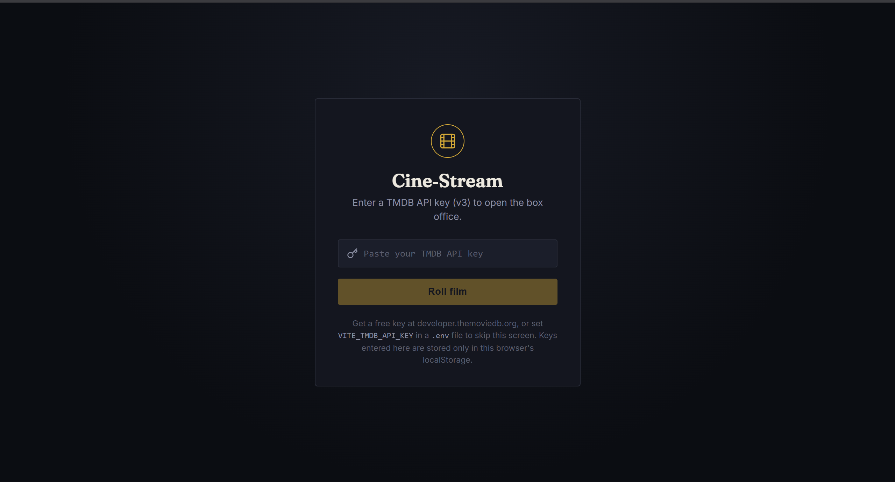

# Cine-Stream 🎬

A React-based movie discovery application powered by the **TMDB API**. Cine-Stream lets users discover trending movies, search for titles, continuously load more results, and save movies to a personal favorites list.

> **Project status:** Core discovery features (browsing, search, infinite scroll, and favorites) are implemented. AI-powered recommendations are planned for a future release.

**Live Demo:** https://cine-stream0.netlify.app/  
**GitHub Repository:** https://github.com/Akarsh-Coding/CineStream/tree/previous-version

---

## ✨ Features

### Core Architecture & API Consumption

- ⚛️ React + Vite project setup
- 🎬 TMDB API integration
- 🔐 TMDB API key validation
- 💾 API key persistence using browser `localStorage`
- 🧭 Discover and Favorites views
- 🔎 Movie search
- 🖼️ Responsive movie-card grid
- ⭐ Movie ratings and release years
- ❤️ Favorites functionality
- ⚠️ Loading, error, and empty states
- 🎨 Dark, cinema-inspired user interface

### Performance & Persistence

- ♾️ Infinite scrolling for movie discovery
- 🔍 Debounced search input to reduce unnecessary API requests
- ❤️ Persistent favorites stored locally in the browser
- 🚦 Loading-more state while additional pages are fetched
- 🛡️ Request handling to prevent outdated API responses from overwriting newer results

---

## 🛠️ Tech Stack

| Technology | Purpose |
| --- | --- |
| **React 18** | Frontend UI and application state |
| **Vite** | Development server and production build |
| **TMDB API** | Movie data, posters, ratings, and search |
| **Lucide React** | UI icons |
| **JavaScript (ES Modules)** | Application logic |
| **CSS** | Styling and responsive layout |
| **LocalStorage** | API key and favorites persistence |
| **Netlify** | Deployment |

The `previous-version` branch uses React 18.3.1, Vite 5.4.x, and Lucide React 0.383.x. 

---

## 📸 Screenshots

### 1. TMDB API Key Setup

Users can provide a TMDB API key through the initial setup screen. The application validates the key before allowing access to the movie explorer.



### 2. Discover — Trending Movies

The Discover page displays trending movies in a poster-based grid with ratings, release years, search, favorites, and infinite scrolling.


### 3. Favorites

The Favorites view displays movies saved by the user and keeps the saved list available through browser persistence.


---

## 🔑 API Key Setup

Cine-Stream uses the **TMDB API v3**.

There are two supported ways to provide the API key:

### Option 1 — Environment Variable

Create a `.env` file in the project root:

```env
VITE_TMDB_API_KEY=your_tmdb_api_key
```

Restart the development server after adding or changing the environment variable.

### Option 2 — In-App API Key Entry

If no environment variable is available, Cine-Stream displays an API key setup screen where the user can enter a TMDB API key.

The entered key is saved in the browser's `localStorage`, so it can be reused on subsequent visits from the same browser.

> Never commit a real API key or `.env` file containing secrets to GitHub.

---

## 🚀 Getting Started

### 1. Clone the repository

```bash
git clone https://github.com/Akarsh-Coding/CineStream.git
cd CineStream
git checkout previous-version
```

### 2. Install dependencies

```bash
npm install
```

### 3. Configure the TMDB API key

Create a `.env` file:

```env
VITE_TMDB_API_KEY=your_tmdb_api_key
```

### 4. Start the development server

```bash
npm run dev
```

The Vite development server will provide a local URL in the terminal.

### 5. Create a production build

```bash
npm run build
```

### 6. Preview the production build

```bash
npm run preview
```

---

## 🔎 How It Works

```text
User opens Cine-Stream
        │
        ▼
TMDB API key available?
   ┌────┴────┐
  No        Yes
   │          │
   ▼          ▼
API Key     Discover
  Gate        Page
   │          │
   ▼          ├── Search movies
Validate      │
key           ├── Infinite scroll
   │          │
   └──────────┤
              ▼
        Movie Results
              │
              ├── Save to Favorites
              │
              ▼
         Favorites View
```

### Search Flow

Search input is debounced before the API request is made. This prevents an API call from being triggered for every individual keystroke.

### Infinite Scroll Flow

When the user reaches the end of the currently loaded movie list, another TMDB page is requested and appended to the existing results.

### Favorites Flow

Clicking the heart icon toggles a movie's favorite state. Favorites are persisted locally so they remain available after refreshing the page.

---

## 📁 Project Structure

```text
CineStream/
├── src/
│   ├── api/
│   │   └── tmdb.js
│   ├── components/
│   │   ├── ApiKeyGate.jsx
│   │   ├── EmptyState.jsx
│   │   ├── Header.jsx
│   │   ├── MovieCard.jsx
│   │   ├── MovieGrid.jsx
│   │   ├── PosterFallback.jsx
│   │   ├── RatingBadge.jsx
│   │   └── SkeletonCard.jsx
│   ├── hooks/
│   │   ├── useDebouncedValue.js
│   │   ├── useFavorites.js
│   │   └── useInfiniteScroll.js
│   ├── App.jsx
│   ├── App.css
│   ├── index.css
│   └── main.jsx
├── screenshots/
│   ├── api-key-gate.png
│   ├── discover.png
│   └── favorites.png
├── .gitignore
├── index.html
├── package.json
├── package-lock.json
└── vite.config.js
```

---

## 📌 Current Progress

| Milestone | Scope | Status |
| --- | --- | --- |
| **Core & Search** | Base architecture, TMDB API integration, UI, and search | ✅ Completed |
| **Performance & Persistence** | Infinite scroll, debounced search, and persistent favorites | ✅ Completed |
| **AI & Asset Optimization** | AI-powered recommendations and asset optimization | ⏳ Planned |

The current version intentionally documents only the work completed so far.

---

## 🎯 Learning Objectives

This project was built as a practical exercise in:

- Building a React application from a structured engineering specification
- Working with a third-party REST API
- Managing asynchronous API requests and loading states
- Implementing debounced user input
- Implementing infinite scrolling with the `IntersectionObserver` approach
- Persisting client-side application data with `localStorage`
- Designing reusable React components and custom hooks
- Handling API errors and empty states
- Deploying a Vite/React application with environment configuration

---

## ⚠️ Limitations

- Movie data depends on the TMDB API.
- A valid TMDB API key is required.
- Favourites are stored locally in the browser and are not associated with a user account.
- There is no backend or server-side database.
- AI-powered recommendations are **not yet implemented** and are planned for a future release.
- The project is intended for **learning and portfolio purposes only** and is not intended for commercial use.

---

## 📄 Disclaimer

Cine-Stream is an independent learning project and is **not affiliated with or endorsed by TMDB**.

Movie information and artwork are provided through the TMDB API.

---

## 👨‍💻 Author

**Akarsh Kumar**

---

⭐ If you find this project useful, feel free to explore the repository and follow its future development.
