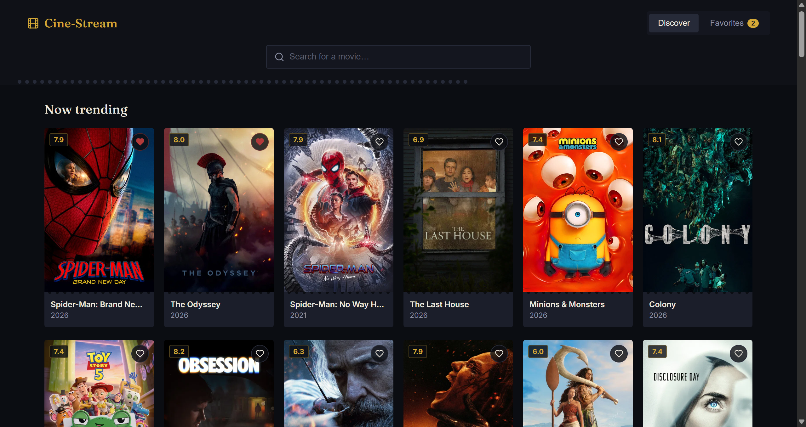
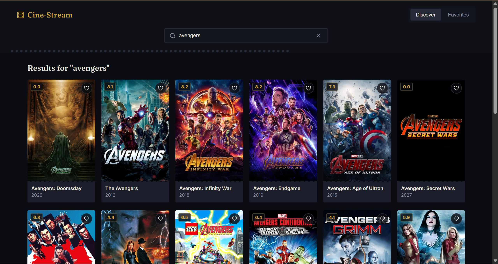
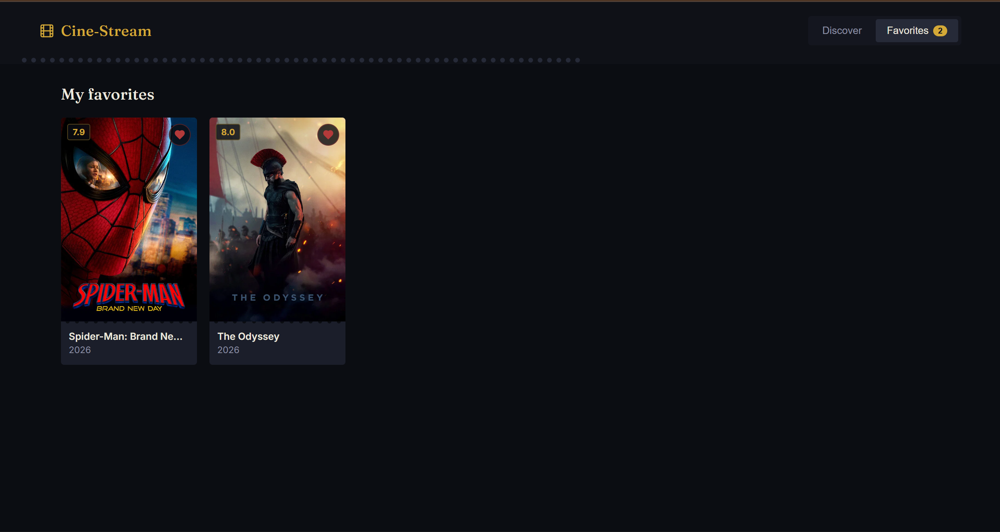

# Cine-Stream 🎬

A full-stack movie discovery and watchlist application. Cine-Stream pulls movie data from the **TMDB API** through a lightweight Node/Express proxy, and stores each user's **watchlist, ratings, and reviews** in MongoDB through a separate backend, **[DataStorm-API](https://github.com/Akarsh-Coding/DataStorm-API)**.

> **Project status:** Discovery (browse, search, infinite scroll) and the full watchlist pipeline (create, read, update, delete, image upload) are implemented and wired to a live backend. AI-powered recommendations are planned for a future release.

**Live Demo:** https://cinestream-zeq2.onrender.com/  
**GitHub Repository:** https://github.com/Akarsh-Coding/CineStream/tree/main  
**Backend (DataStorm-API) repository:** https://github.com/Akarsh-Coding/DataStorm-API  
**Backend live URL:** `<add your Render URL for DataStorm-API here>`

---

## ✨ Features

### Core Architecture & API Consumption

- ⚛️ React + Vite project setup
- 🎬 TMDB API integration via a backend proxy
- 🔐 TMDB API key held server-side, never exposed to the browser
- 🧭 Discover and Watchlist views
- 🔎 Movie search
- 🖼️ Responsive movie-card grid
- ⭐ Movie ratings and release years
- 🎨 Dark, cinema-inspired user interface

### Watchlist, Reviews & Persistence (backed by MongoDB)

- 🔖 Bookmark any movie in Discover to add it to your watchlist
- 📋 Watchlist split into **Want to Watch** and **Watched** sections
- ✅ Mark a movie as watched (or move it back to Want to Watch)
- ⭐ Rate a watched movie (1–10) and write a review
- ➕ Quick-add form to add a movie by title, with an optional custom thumbnail
- 🖼️ Thumbnail upload sent as `multipart/form-data`; the image is hosted on Cloudinary and only its URL is stored
- 🗑️ Remove entries, with the list updating instantly (no page reload)
- 💾 Data persists across hard refreshes because it lives in MongoDB Atlas, not in the browser

### Performance & Reliability

- ♾️ Infinite scrolling for movie discovery
- 🔍 Debounced search input to reduce unnecessary API requests
- 🛡️ Request handling to prevent outdated API responses from overwriting newer results
- 🚦 Loading states for every request: initial fetch, load-more, and per-item pending states for create, update, and delete
- ⚠️ Inline error banners when the backend is unreachable or returns an error
- 🧱 React error boundary so an unexpected render crash shows a clean fallback instead of a blank screen

---

## 🛠️ Tech Stack

| Technology | Purpose |
| --- | --- |
| **React 18** | Frontend UI and application state |
| **Vite** | Frontend development server and production build |
| **Node.js / Express** | Server that proxies TMDB requests, holds the TMDB key, and serves the built frontend in production |
| **TMDB API** | Movie data, posters, ratings, and search |
| **DataStorm-API** | Separate Express + MongoDB backend that stores watchlist entries and reviews |
| **MongoDB Atlas** | Persistent storage (accessed through DataStorm-API) |
| **Cloudinary** | Image hosting for uploaded thumbnails (accessed through DataStorm-API) |
| **Lucide React** | UI icons |
| **JavaScript (ES Modules)** | Application logic |
| **CSS** | Styling and responsive layout |
| **Render** | Deployment (Node web service) |

---

## 🧩 Architecture

CineStream and DataStorm-API are two separate repositories and two separate deployments.

```text
                    ┌──────────────────────────────────────────┐
                    │          CineStream (this repo)          │
                    │                                          │
 Browser ──────────►│  React app (built by Vite)               │
                    │  served by Express  (server/index.js)    │
                    │                                          │
                    │  /api/movies/*  ──►  TMDB API            │
                    │   (TMDB key stays server-side)           │
                    └───────────────┬──────────────────────────┘
                                    │
          Browser calls directly    │  VITE_API_URL
          (watchlist CRUD + upload) ▼
                    ┌──────────────────────────────────────────┐
                    │        DataStorm-API (separate repo)     │
                    │  Express + CORS + multer                 │
                    │       │                    │             │
                    │       ▼                    ▼             │
                    │  MongoDB Atlas        Cloudinary         │
                    │  (posts)              (image files)      │
                    └──────────────────────────────────────────┘
```

- **Movie data** goes browser → CineStream's Express server → TMDB.
- **Watchlist data** goes browser → DataStorm-API → MongoDB. This is a cross-origin request, so DataStorm-API must allow CineStream's origin through CORS (see `CLIENT_ORIGIN` below).

---

## 📸 Screenshots

### 1. Discover — Trending Movies

The Discover page displays trending movies in a poster-based grid with ratings, release years, search, a watchlist bookmark, and infinite scrolling.



### 2. Search

Searching returns matching titles from TMDB, fetched through the backend so no API key is ever exposed to the browser.



### 3. Favorites (earlier version)

The original Sprint 08 Favorites view, which stored saved movies in browser `localStorage`. This has since been replaced by the MongoDB-backed Watchlist described above, so this screenshot should be refreshed.



---

## 🔐 Environment Variables

CineStream uses **two separate** env files because two different programs read them.

| File | Variable | Read by | Purpose |
| --- | --- | --- | --- |
| `server/.env` | `TMDB_API_KEY` | `server/index.js` (at runtime) | Key used to call TMDB on the frontend's behalf |
| `.env` (project root) | `VITE_API_URL` | Vite (**at build time**) | Base URL of your DataStorm-API backend |

### `server/.env`

```env
TMDB_API_KEY=your_tmdb_api_key
```

### `.env` (project root)

```env
VITE_API_URL=http://localhost:5000
```

- If `VITE_API_URL` is unset, the app falls back to `http://localhost:5000`.
- In production, set it to your live DataStorm-API URL with **no trailing slash**, for example `https://your-backend.onrender.com`.
- Vite replaces `import.meta.env.VITE_API_URL` with its value **while building**, not while running. If you change it, you must rebuild/redeploy.

Copy `.env.example` and `server/.env.example` to get started. Never commit real `.env` files.

---

## 🚀 Getting Started

### Prerequisites

- Node.js 18+
- A TMDB API key (https://www.themoviedb.org/settings/api)
- A running instance of **DataStorm-API** (locally or deployed). See its README for setup.

### 1. Clone the repository

```bash
git clone https://github.com/Akarsh-Coding/CineStream.git
cd CineStream
```

### 2. Install dependencies

```bash
npm install
```

### 3. Configure environment variables

Create `server/.env` with your `TMDB_API_KEY`, and a root `.env` with `VITE_API_URL` (see above).

### 4. Start DataStorm-API

In its own repo and terminal (listens on port 5000 by default):

```bash
npm run dev
```

### 5. Start the TMDB proxy server

From the CineStream folder (listens on port 5174 by default):

```bash
npm run dev:server
```

### 6. Start the frontend dev server

In a third terminal:

```bash
npm run dev
```

Open the local URL Vite prints (usually `http://localhost:5173`). During development, Vite forwards `/api/*` requests to the TMDB proxy on port 5174 (configured in `vite.config.js`). Watchlist requests go straight to DataStorm-API, so the backend's `CLIENT_ORIGIN` must be `http://localhost:5173`.

### 7. Create and preview a production build

```bash
npm run build
npm start
```

`npm start` runs `server/index.js`, which serves the built `dist/` folder and the `/api/movies/*` proxy from a single process, exactly as it does on Render.

---

## ☁️ Deployment (Render)

CineStream deploys as a **single Render Web Service**, because its Express server both proxies TMDB and serves the built frontend. This is why it is deployed on Render rather than as a static site.

| Setting | Value |
| --- | --- |
| Build Command | `npm install && npm run build` |
| Start Command | `npm start` |

Environment variables (set in the Render dashboard, not in code):

| Variable | Value |
| --- | --- |
| `TMDB_API_KEY` | Your TMDB API key |
| `VITE_API_URL` | Your live DataStorm-API URL (no trailing slash). Must be set **before** the build runs |

After deploying, set `CLIENT_ORIGIN` on the DataStorm-API service to this app's live URL, otherwise the browser will block the watchlist requests with a CORS error.

> Render's free tier spins services down after inactivity, so the first request can take 30–50 seconds. Open both live URLs a minute or two before a demo.

### Post-deploy verification checklist

1. Open the DataStorm-API root URL and confirm it responds with `The Data Hub API is running`.
2. On the live CineStream site, run `fetch('<backend-url>/posts')` in the browser console and confirm there is no CORS error.
3. Open the Watchlist tab and confirm entries load (or the empty state shows).
4. Add a movie and confirm it appears immediately.
5. Hard refresh and confirm the entry is still there.
6. Mark a movie watched, add a rating and review, then hard refresh to confirm it persisted.
7. Remove an entry, hard refresh, and confirm it stays gone.
8. Quick-add a movie with a thumbnail and confirm the image `src` is a `res.cloudinary.com` URL that still loads after a refresh.

---

## 🔎 How It Works

### Discover Flow

Search input is debounced before the request is made to the proxy server, which queries TMDB. When the user reaches the end of the loaded list, the next page is requested and appended.

### Watchlist Flow

Every watchlist entry is one document in MongoDB (a "post" in DataStorm-API), tied to a TMDB movie.

| Action | Request | UI update |
| --- | --- | --- |
| Page load | `GET /posts` | List rendered from the response |
| Add (bookmark or quick-add) | `POST /posts` | New entry prepended to local state |
| Add with thumbnail | `POST /posts` as `multipart/form-data` | Same, with the Cloudinary URL as the poster |
| Mark watched / move back / save review | `PUT /posts/:id` | Entry replaced in local state |
| Remove | `DELETE /posts/:id` | Entry filtered out of local state |

All updates apply to local React state after the request succeeds, so nothing needs a page reload. Each in-flight action disables its own controls, and failures show an inline error banner.

### Entry Shape

```json
{
  "movieId": 550,
  "movieTitle": "Fight Club",
  "moviePoster": "/abc123.jpg",
  "status": "want_to_watch",
  "rating": 9,
  "content": "Great ending.",
  "createdAt": "2026-09-01T05:41:50.190Z"
}
```

`status` is `want_to_watch` or `watched`. `rating` and `content` are optional and are meant to be filled once a movie is watched. Entries added through the quick-add form use a negative, timestamp-based `movieId` so they can never collide with a real TMDB id.

---

## 📁 Project Structure

```text
CineStream/
├── server/
│   ├── .env.example
│   └── index.js            # TMDB proxy + serves built frontend
├── src/
│   ├── api/
│   │   ├── tmdb.js         # movie data (via the proxy)
│   │   └── posts.js        # watchlist CRUD + multipart upload (DataStorm-API)
│   ├── components/
│   │   ├── EmptyState.jsx
│   │   ├── ErrorBoundary.jsx
│   │   ├── Header.jsx
│   │   ├── MovieCard.jsx
│   │   ├── MovieGrid.jsx
│   │   ├── PosterFallback.jsx
│   │   ├── QuickAddForm.jsx
│   │   ├── RatingBadge.jsx
│   │   ├── SkeletonCard.jsx
│   │   └── WatchlistView.jsx
│   ├── hooks/
│   │   ├── useDebouncedValue.js
│   │   ├── useInfiniteScroll.js
│   │   └── useWatchlist.js
│   ├── App.jsx
│   ├── App.css
│   ├── index.css
│   └── main.jsx
├── screenshots/
├── .env.example
├── .gitignore
├── index.html
├── package.json
└── vite.config.js
```

---

## 📌 Current Progress

| Milestone | Scope | Status |
| --- | --- | --- |
| **Core & Search** | Base architecture, TMDB API integration, UI, and search | ✅ Completed |
| **Performance & Persistence** | Infinite scroll, debounced search | ✅ Completed |
| **Backend Proxy** | Express server holding the TMDB key | ✅ Completed |
| **Full-Stack Integration** | Watchlist, reviews, and image uploads backed by DataStorm-API and MongoDB | ✅ Completed |
| **Deployment** | Both services live on Render with environment-based configuration | ✅ Completed |
| **AI & Asset Optimization** | AI-powered recommendations | ⏳ Planned |

---

## 🎯 Learning Objectives

This project was built as a practical exercise in:

- Building a React application from a structured engineering specification
- Working with a third-party REST API
- Managing asynchronous requests, loading states, and error states
- Implementing debounced input and infinite scrolling
- Building a small Node/Express proxy to keep secrets off the client
- Integrating a React SPA with a separate Node/MongoDB REST API
- Resolving CORS between two origins
- Implementing a full CRUD UI pipeline with immediate local state updates
- Uploading files with `FormData` and hosting them on a cloud CDN
- Managing environment variables across local and production environments
- Deploying a full-stack application to Render

---

## ⚠️ Limitations

- Movie data depends on the TMDB API, and a valid TMDB key is required on the server.
- There is no user authentication. The watchlist is a single shared list for everyone using a given deployment.
- Movies added through the quick-add form are not linked to a TMDB record.
- Uploaded thumbnails are limited to 5 MB and image file types.
- On Render's free tier, services may take 30–50 seconds to wake after inactivity.
- AI-powered recommendations are **not yet implemented**.
- The project is intended for **learning and portfolio purposes only** and is not intended for commercial use.

---

## 📄 Disclaimer

Cine-Stream is an independent learning project and is **not affiliated with or endorsed by TMDB**.

Movie information and artwork are provided through the TMDB API.

---

## 👨‍💻 Author

**Akarsh Kumar**

---

⭐ If you find this project useful, feel free to explore the repository and follow its future development.
